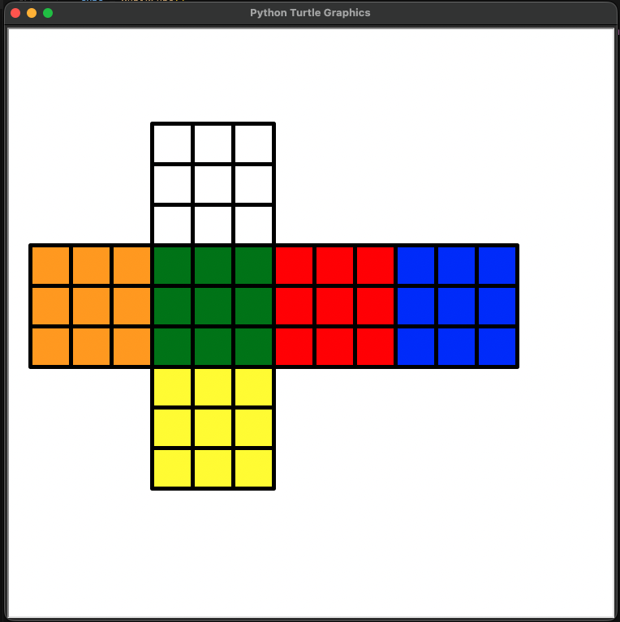
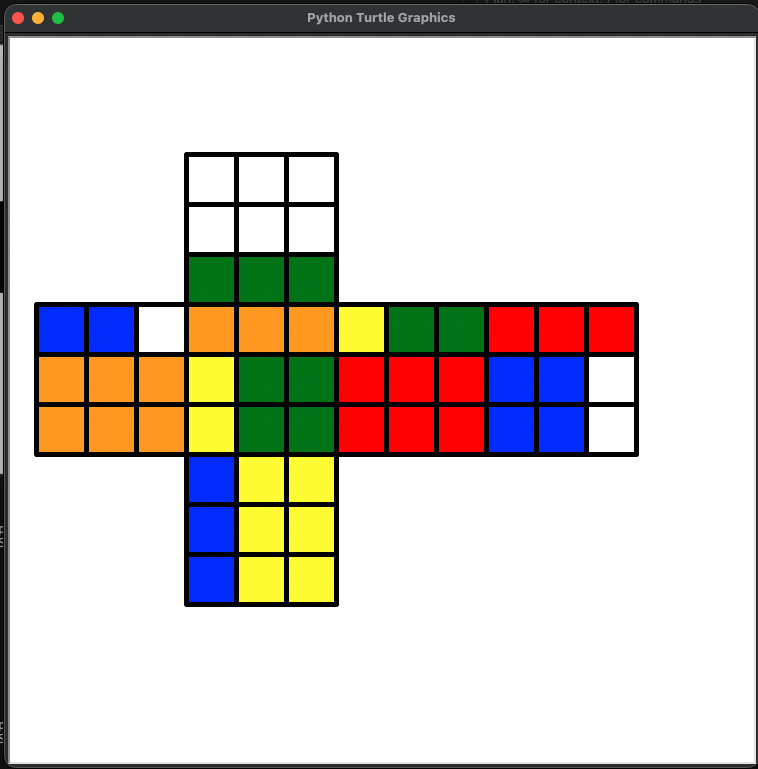
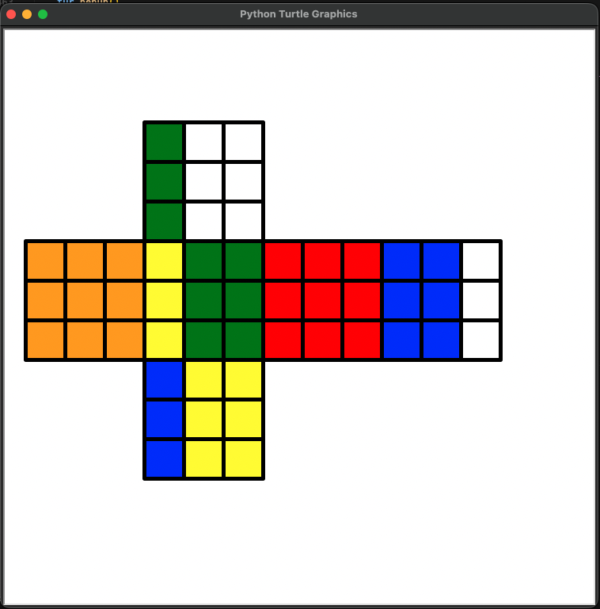
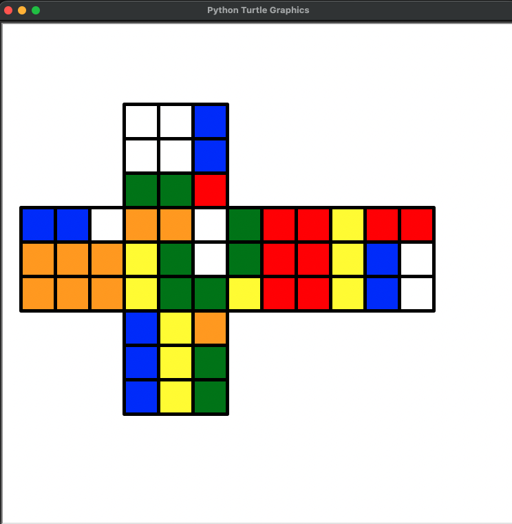
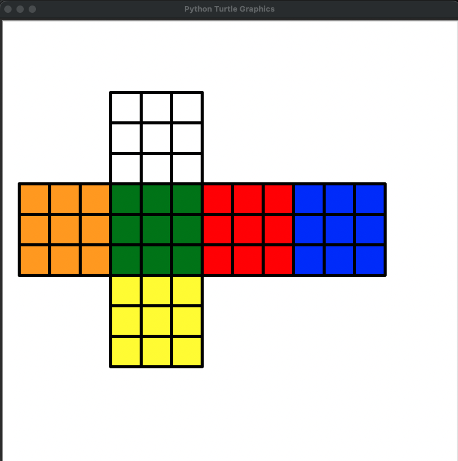

# RubikCube-TreeSearch

This repo is a small Rubik’s Cube solver demo: you scramble a 3×3 cube, then it uses a tree search (BFS) to find a sequence of moves that brings the cube back to the solved state.

- `RubikCubeSolver-Python.py`: interactive CLI scrambler + BFS solver (with a simple `turtle` visualization).
- `RubikCubeSolver-CPP.cpp`: the same idea in C++; it was able to handle longer scrambles / deeper searches for me (presumably thanks to better memory usage and speed in C++).

## Quick run

`python RubikCubeSolver-Python.py`

## Pics

Screenshots are in `pics/`:

**Initial state** 

**After U** 

**After L** 

**After R** 

**Solved** 

