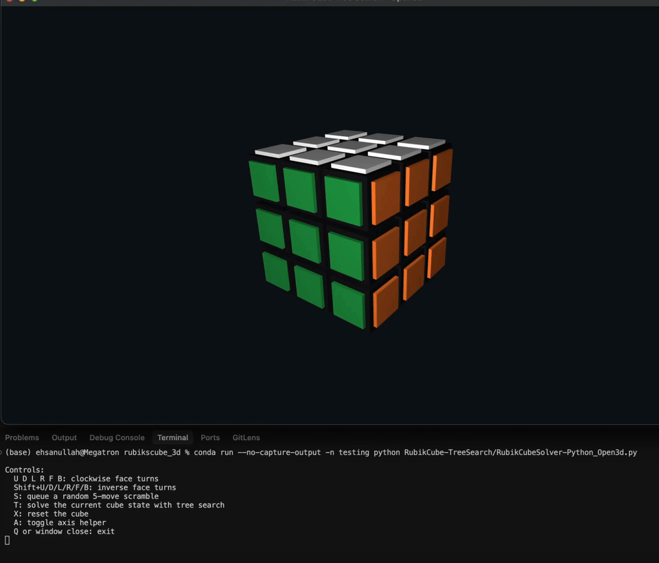

# RubikCube-TreeSearch

This repo is a small Rubik’s Cube solver demo: you scramble a 3×3 cube, then it uses a tree search (BFS) to find a sequence of moves that brings the cube back to the solved state.

 - `RubikCubeSolver-Python_Open3d.py`: Open3D-based interactive Rubik's Cube demo with manual moves, scramble, and tree-search solving.
- `RubikCubeSolver-Python.py`: interactive CLI scrambler + BFS solver (with a simple `turtle` visualization).
- `RubikCubeSolver-CPP.cpp`: the same idea in C++; it was able to handle longer scrambles / deeper searches for me (presumably thanks to better memory usage and speed in C++).

## Quick run

```bash
conda create -n rubikcube python=3.11 -y
conda activate rubikcube
conda install -c conda-forge open3d -y
conda run --no-capture-output -n rubikcube python RubikCubeSolver-Python_Open3d.py
```

## Demo Video




